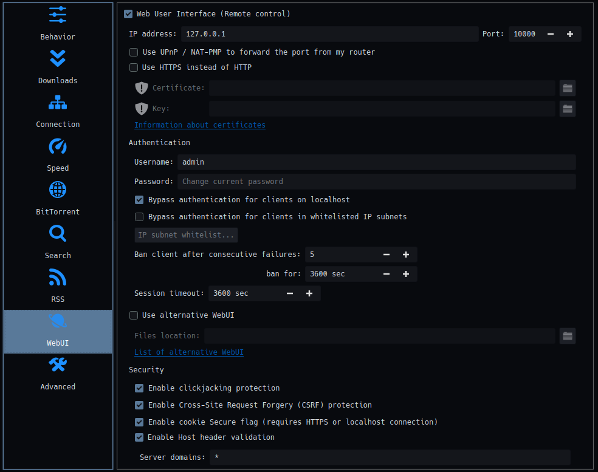

# Tracker-Replace

Replace one tracker URL with another in qBittorrent. Useful to change tracker pid or url for multiple torrents.

## Requirements

- Python >= 3.12
- pip
- git

## Installation

```bash
git clone https://github.com/boydaihungst/tracker-replace.git
cd tracker-replace
```

You may need to create a virtual environment first. See [here](https://python.land/virtual-environments/virtualenv) to learn how to create one.

### Setup python environment for Windows

Step 1: Install [Python](https://www.python.org/downloads/) and add it to the `PATH` environment variable.

Step 2: Create the Virtual Environment in folder `crunchyroll-sub-downloader`: `python -m venv .venv`

Step 3: Activate the Virtual Environment (rerun this step every time you open a new terminal):

```bash
# window cmd
.venv\Scripts\activate.bat
# or
# window powershell
Set-ExecutionPolicy Unrestricted -Scope Process
.venv\Scripts\Activate.ps1
```

Step 4: Install python libraies:
`pip install -r requirements.txt`

### Setup python environment for Unix-based systems

Step 1: Install Python, using your pakcage manager and add it to the `PATH` environment variable.
For example, on Ubuntu:

```bash
sudo apt install python3.12
```

Step 2: Create the Virtual Environment in folder `crunchyroll-sub-downloader` : `python -m venv .venv`

Step 3: Activate the Virtual Environment (rerun this step every time you open a new terminal):

```bash
# for fish shell
. .venv/bin/activate.fish
# bash shell
. .venv/bin/activate
```

## Usage

Make sure you enabled `Web User Interface` in qBittorrent > settings > WebUI. Tick `Bypass authentication for clients on localhost` if you are using localhost as the url so you can get rid of `--username --password`.



```bash
usage: main.py [-h] [-U URL] [-u USERNAME] [-p PASSWORD] old_tracker_url new_tracker_url

Bulk replace old tracker URL with new tracker URL

positional arguments:
  old_tracker_url       The old tracker URL.
  new_tracker_url       The new tracker URL.

options:
  -h, --help            show this help message and exit
  -U, --url URL         Qbittorent URL. Default: http://localhost:8080
  -u, --username USERNAME
                        Qbittorent authentication username.
                        Leave empty if "Bypass authentication for clients on localhost" is enabled in qBittorrent and the url is localhost or 127.0.0.1.
  -p, --password PASSWORD
                        Qbittorent authentication password.
                        Leave empty if "Bypass authentication for clients on localhost" is enabled in qBittorrent and the url is localhost or 127.0.0.1.

```

Example:

```bash
python3 main.py "http://any_tracker_url:7777/announce?pid=XYZ" "http://any_tracker_url:7777/announce?pid=ABC" -U http://localhost:10000
```

## License

This project is licensed under the MIT License - see the [LICENSE](LICENSE) file for details.
